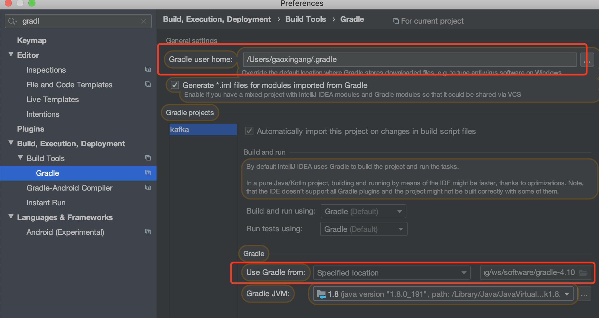
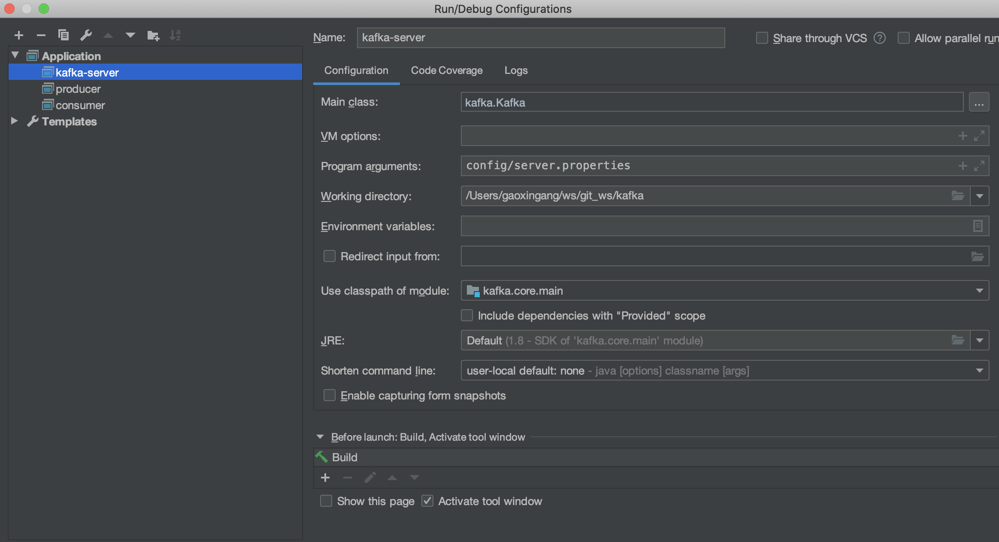
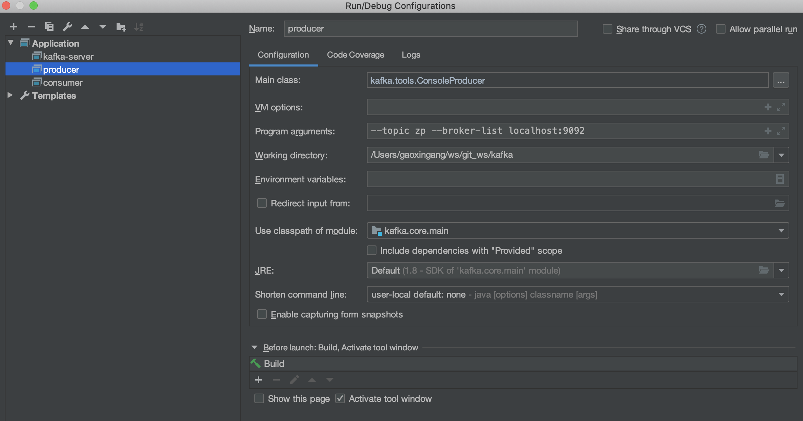
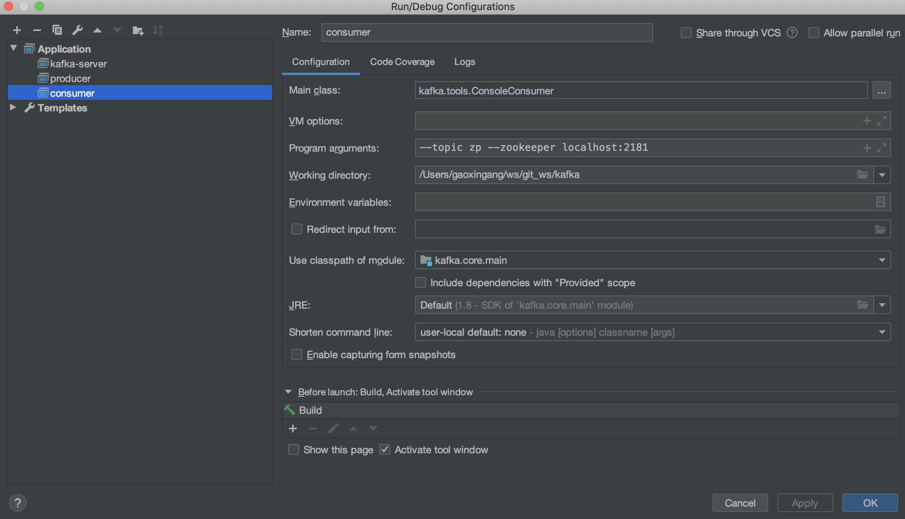
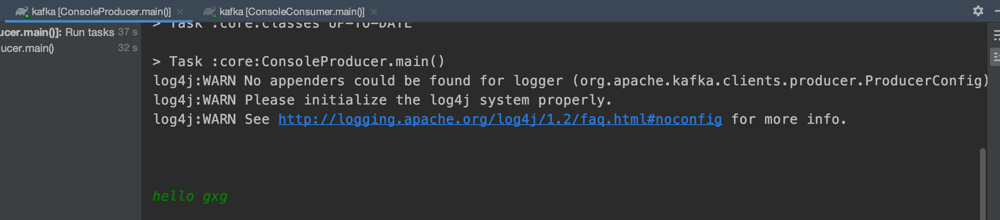
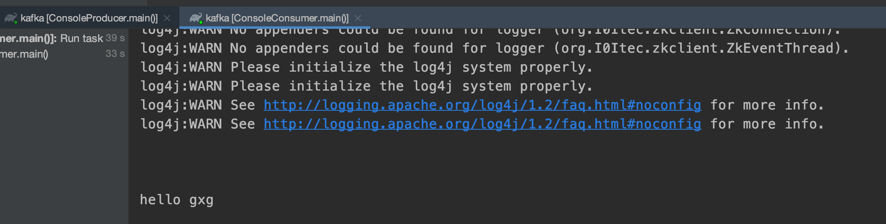

kafka0.10 mac编译 导入clion

下载源码 

    fork 到自己的空间 
    git clone https://github.com/ipandage/kafka.git
    切换到0.10分支

配置gradle

    下载 gradle-4.10，过高版本gradle编译报错
    配置环境变量
    export GRADLE_HOME=/Users/gaoxingang/ws/software/gradle-4.10
    export PATH=$PATH:$GRADLE_HOME/bin

idea下载scala插件，也可以选择离线下载安装
    
    https://plugins.jetbrains.com/plugin/index?xmlId=org.intellij.scala

导入idea作为gradle项目

    设置gradle 执行仓库地址，和本地gradle home
   
   
将config目录下的log4j.properties文件拷贝到core\src\main\scala\目录下

启动kafka服务器，即运行core\src\main\scala\kafka\Kafka.scala中的main方法，运行前指定启动参数

   
   
启动生产者，设置启动参数
    
   

启动消费者，设置启动参数
    
   

启动kafka服务器前，启动zk，可以使用bin下的脚本，执行

    ./bin/zookeeper-server-start.sh config/zookeeper.properties
    
生产者控制台输入消息 hello gxg，回车

   

观察消费者控制台接收到的消息

   

启动成功!
